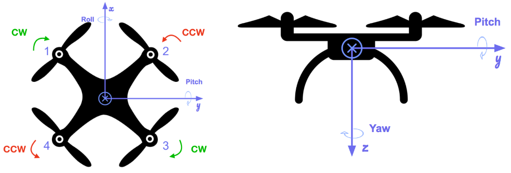
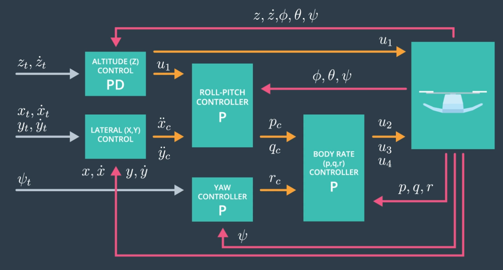
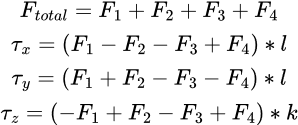
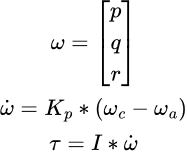
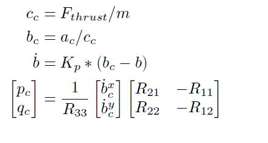
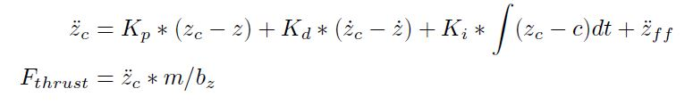
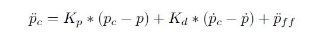
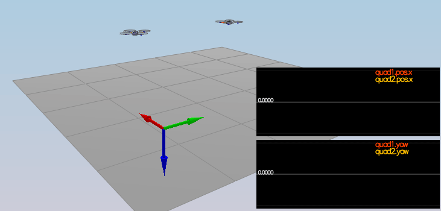
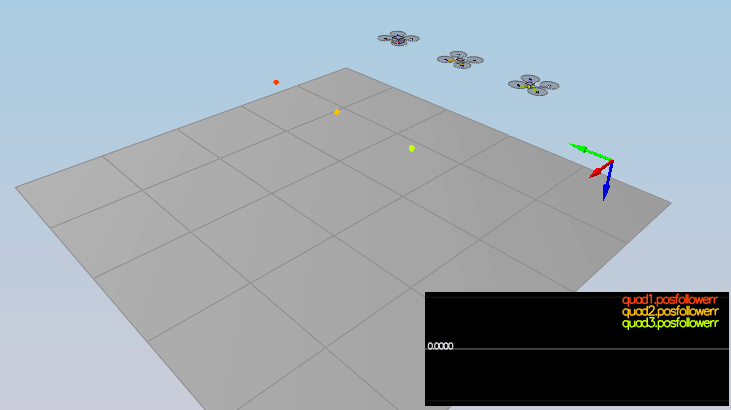
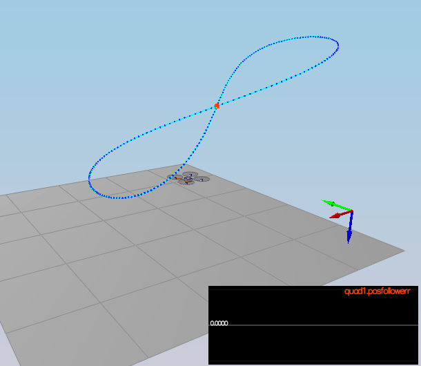

The C++ Quadcoptor Controller
=============================

In this project I'm buidling and tuning a cascaded PID controller to enable a quadcoptor to follow a provided trajectory.

Quadcoptor has 4 motors with attached propellers. 1st and 3rd propellers rotating in clockwise direction and 2nd and 4th in counter-clockwise direction. See image below for propeller location on the drone.

# Design

Controller is comprised of 5 PID controllers:

1. **Body Rate Controller**: P controller responsible for generating rotation moments around each axes based on commanded and observed body rotations (p,q,r).
2. **Roll Pitch Controller**: P controller responsible for generating body rotation commands around x (roll) and y (pitch) axes.
3. **Altitude Controller**: feed-forward PID controller responsible for generating collective motor thrust to achive commanded altitude.
4. **Lateral Position Controller**: feed-forward PD controller responsible for generating horizontal acceleration to follow (x,y) coordinates of the trajectory.
5. **Yaw Controller**: P controller responsible for generating body rotation command around z axis (yaw).
6. **Motor Commands Generator**: takes collective thrust from altitude controller and rotating moments from body rate controller and converts these into thrust commands for individual motors.

Overall design of this system is similar to the diagram below:

# Implementation

This section gives brief explanation of how each component was implemented. All of these components are implemented in `src/QuadControl.cpp` as a separate methods of the `QuadControl` class.

## Motor Command Generator

Motor Command Generator is implemented in `GenerateMotorCommands` method.

Inputs:
 - desired collective thrust [N]
 - desired rotation moment about each axis [N m]

Output:
 - motor thrust commands, in [N]

Thrusts are calculated by solving following equations for each individual motors: 

where
 - *l* is the distance from the motors to x and y axes.
 - *k* is the drag-thrust ration, which is dependent on the propeller choice.

 ## Body Rate Controller

Body Rate Controller is implemented in `BodyRateControl` method.

Inputs:
 - desired body rates [rad/s]
 - current or estimated body rates [rad/s]

Output:
 - the desired moments for each of the 3 axes

 Body Rate Controller calculates moments based on the following equations:

 

 where
  - *p,q,r* are rotation speeds in body frame for roll, pitch, and yaw respectively
  - *c* and *a* underscores indicate commanded and actual body rates
  - *K_p* is a proportional control gain parameter
  - *I* is a vector of the moments of inertia for each axes.

## Roll Pitch Controller

Roll Pitch Controller is implemented in `RollPitchcontrol` method.

Inputs:
 - desired acceleration in global XY coordinates [m/s2]
 - current or estimated attitude of the vehicle
 - desired collective thrust of the quad [N]

Output:
 - the desired pitch and roll rates

Roll Pitch Controller calculates roll and pitch rotations using following equations:

where
 - *a_c* is the commanded acceleration
 - *K_p* is a proportional control gain parameter
 - *b* is the last column vector of the rotation matrix describing attitude of the drone
 - *p* and *q* are body rates for roll and pitch

## Altitude Controller

Altitude Controller is implemented in `AltitudeControl` method.

Inputs:
 - desired vertical position and velocity in NED [m]
 - current vertical position and velocity in NED [m]
 - feed-forward vertical acceleration in NED [m/s2]
 - the time step of the measurements [seconds]

Output:
 - collective thrust command in [N]

 Altitude Controller calculates collective thrust using standard equation for PID controller with fast-forward component:

where
 - *K* are proportianal, differential, and integral gain control parameters.
 - *b_z* is the last component of the last vector of the rotation matrix of the current drone attitude

> Note: Integral portion of the controller is also responsible for compensating for any small deviations of the estimaetd physical parameters (e.g. mass) of the drone from the actual values.

## Lateral Position Controller

Lateral Position Controller is implemented in `LateralPositionControl` method.

Inputs:
 - desired position, in NED [m]
 - desired velocity, in NED [m/s]
 - current position, NED [m]
 - current velocity, NED [m/s]
 - feed-forward acceleration, NED [m/s2]

Output:
 - desired horizontal accelerations

Lateral Position Controller calculates accelerations using another PD controller formala:

where
 - *p* are x,y position
 - *p dot* are x,y velocities
 - *p dot dot* are x,y accelerations
 - *K* are proportianal, and differential gain control parameters.

## Yaw Controller

Yaw Controller is implemented in `YawControl` method.

Inputs:
 - commanded yaw [rad]
 - current yaw [rad]

Output:
 - desired yaw rate [rad/s]

Yaw Controller is the simplest controller in this cascaded controller which outputs yaw rate proportional to difference between commanded and current yaw.

# Parameters tuning

All the PID gain paramters can be found in `QuadControlParams.txt`:

 - **Position control gains**
   - proportional gains: 
     - `kpPosXY`, used by Lateral Position Controller
     - `kpPosZ`, used by Altitude Controller
   - differential gains:
     - `kpVelXY`, used by Lateral Position Controller
     - `kpVelZ`, used by Altitude Controller
   - integral gains:
     - `KiPosZ`, used by Altitude Controller
 - **# Angle control gains**
   - proportional gains used by Roll Pitch Controller and Yaw Controller
     - `kpBank` - roll and pitch gain
     - `kpYaw`
 - **Angle rate gains**
   - proportional gains used by Body Rate Controller
     - `kpPQR` - vector of gain parameters for roll, pitch, yaw respectively

> All gains were tuned to enable quadcopter to reliably follow trajectories and reaching target states in reasonable time.

# Results

Here's some of the simulated scenarios used to tune and test Controller.

## Position Control
In this scenario I've tested if controller can bring quadcopter to sligthly adjusted position and yaw and how fast quadcopter converges to the new state.

## Nonidealities
In this scenario I'm testing if controller can adjust to errors in quadcopter physical parameters.

In the animation below: 
 - red quadcopter is significantly heavier than what estimated.
 - orange quadcopter is an ideal quadcopter mathcing all estimated paramters.
 - green quadcopter has it's center of mass shifted.

## Trajectory following
Final scenario tests if quadcopter can follow specified trajectory within reasonable margins.

